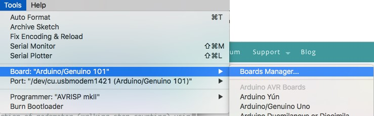
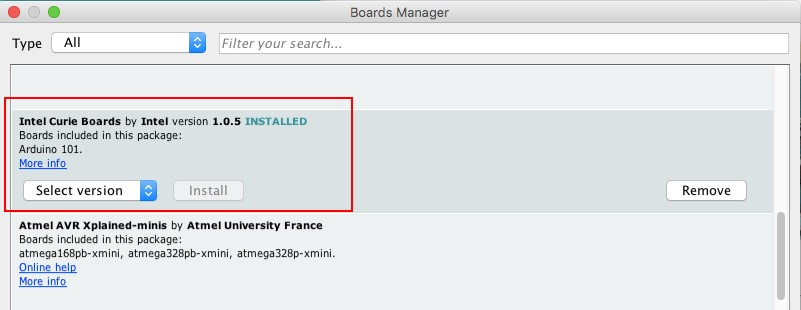
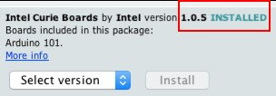
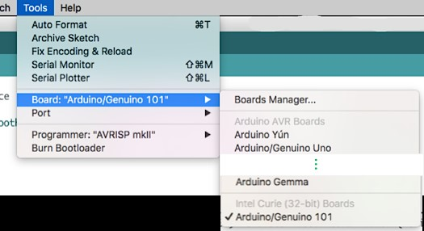

# Appendix A

## Install Curie Libraries

1. Download the Arduino IDE 1.6.7 or later to program Arduino / Genuino 101 from [https://www.arduino.cc/en/Main/Software](https://www.arduino.cc/en/Main/Software)
2. Install the Intel Curie Boards core using Arduino Boards Manager. Navigate to Tools &gt; Board &gt; Boards Manager

1. In the Boards Manager, scroll down to “Intel Curie Boards”, select the latest version available and click “Install”. Required core libraries will be downloaded and installed on your computer. Ensure you have internet connection.

1. A successful installation can be verified by –
   1. “installed” tag appears next to the core name
   2. Arduino / Genuino 101 appears as one of the boards in Tools &gt; Boards menu

 

