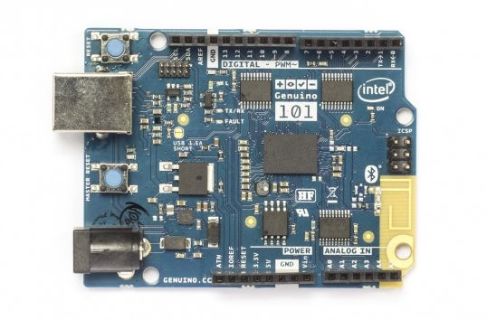
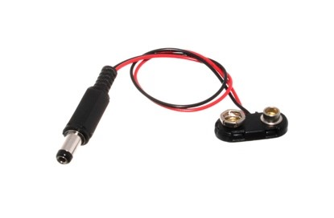

# Prerequisites

You will need the following to do the tutorials below.

[http://www.pakronics.com.au/collections/genuino-arduino-cc/products/genuino-101-pakr-m0012](http://www.pakronics.com.au/collections/genuino-arduino-cc/products/genuino-101-pakr-m0012)

[http://www.pakronics.com.au/products/9v-battery-clip-with-5-5mm-2-1mm-plug-ada80](http://www.pakronics.com.au/products/9v-battery-clip-with-5-5mm-2-1mm-plug-ada80)

