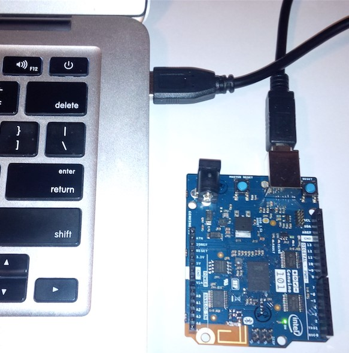
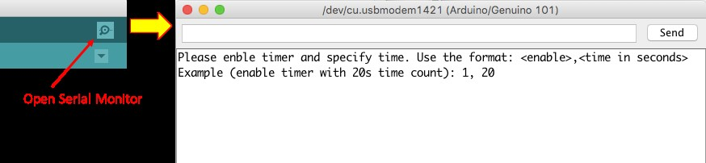
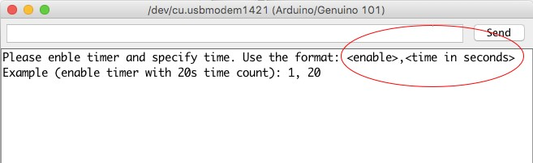
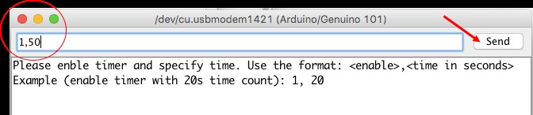
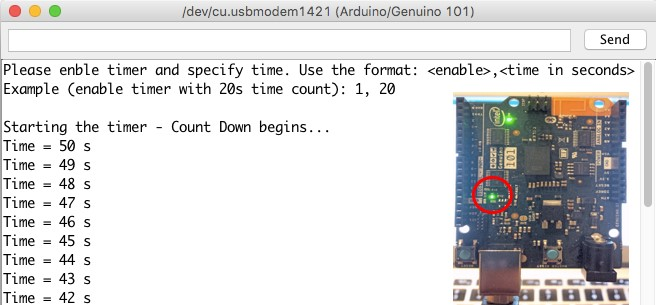

# Timer Switch

## Learning Objectives:

After performing this lab exercise, you will be able to:

* Create Arduino sketch \(code\) and program Arduino/Genuino 101 board
* Understand the working of available timers in Arduino/Genuino 101
* Set interrupt at variable intervals using timers
* Use timer 1 to make a count-down timer switch
* Turn on the on-board LED \(or external relay\) for a specified time

## Working principle of key components

Before performing this lab experiment, it is important to learn following concepts:

* Arduino/Genuino 101 is a low-power consumption and high-performance version of Arduino board with Bluetooth low-energy \(BLE\) and accelerometer on board. It is compatible with Arduino/Genuino Uno in term of form factor and peripheral list. \(For more details, please visit: [https://www.arduino.cc/en/Main/ArduinoBoard101](https://www.arduino.cc/en/Main/ArduinoBoard101)\).
* Arduino/Genuino 101 can be easily programmed using Arduino IDE \(version 1.6.7 and higher\). However, the hardware libraries for Arduino/Genuino 101 board needs to be updated / installed. \(Refer appendix for detailed procedure\).
* CurieTimerOne library provides access to the Timer1 of Arduino/Genuino 101. Using this library, you can set up the time \(in microseconds\) that the timer would count before asserting an interrupt \(further details on the library is available at: [https://www.arduino.cc/en/Reference/CurieTimerOne](https://www.arduino.cc/en/Reference/CurieTimerOne)\).
* The interrupt can be configured to call a specific function \(callback function\) that will be executed every time the interrupt is asserted.
* Typically, a timer interrupt is used in making of timer switch or generating fully customizable Pulse Width Modulated \(PWM\) signals.
* A timer switch is a time-controlled switch that has user-defined on or off time. Once the timer is enabled, the timer waits till the specified time and then makes the switching.

## Key commands

Before programming the Arduino/Genuino 101, it is important to learn following key commands:

* Serial.parseInt

Reads from the serial port and parses the “,” separated string into integer value

* CurieTimerOne.start

Starts the timer \(counting\) with specified time in microseconds and attaches the given function to the interrupt for callback

* delay

Halts the execution by specified time in milliseconds

* digitalWrite

Turn on/off a digital pin of the Arduino / Genuino board

* digitalRead

Reads the status \(on or off\) of a digital pin

## Check Your Understanding

1. A timer switch, after user specified time, would \_\_\_
   1. Turn on the connected device
   2. Turn off the connected device
   3. Both a & b
   4. Not change the status of the device
2. CurieTimerOne library used in this example allow access to \_\_\_
   1. Timer 1
   2. Timer 2
   3. Timer 3
   4. All the timers
3. The instruction “delay\(500\)” would \_\_\_
   1. Halt the program execution for 500 seconds
   2. Halt the program execution for 500 milliseconds
   3. Halt the program execution for 500 microseconds
   4. Halt the program execution for 500 nanoseconds
4. Which command will start the timer with given time and attach the callback function?
   1. CurieTimerOne.attachInterrup\(\)
   2. CurieTimerOne.restart\(\)
   3. CurieTimerOne.resume\(\)
   4. CurieTimerOne.start\(\)
5. Which of the following command can be used to read integer values from serial port?
   1. Serial.parseInt
   2. Serial.println
   3. Serial.readInt
   4. Serial.print
6. A timer switch could also be used for \_\_\_\_\_
   1. Generating PWM
   2. Keeping a device continuously off for 24 hours
   3. Keeping a device continuously on for 24 hours
   4. All of the above
7. Time value for “CurieTimerOne.start” command is specified in
   1. seconds
   2. milliseconds
   3. microseconds
   4. nanoseconds

The answers to the above questions can be found at [Appendix B](appendices/appendix-b.md).

## Procedure

### Hardware Setup

1. Connect the Arduino/Genuino 101 board with computer using USB cable.

### Arduino IDE / Library Setup

1. Make sure you have Arduino IDE version 1.6.7 or higher and Intel Genuino 101 drivers installed on your computer. For installation of Arduino IDE and drivers, you can follow instructions from [Appendix A](appendices/appendix-a.md).

### Creating Sketch / Program

Open the sketch \(G101\_Ex-5\_Timer-Switch.ino\) on Arduino IDE.

From Tools menu, select the right board \(i.e., Arduino/Genuino 101\) and COM Port it is connected to.

Compile \(verify\) and run \(upload\) the sketch on Arduino board. In case of any upload error, try pressing the Master Reset Button just at the start of upload process.

Open the “serial monitor” of Arduino IDE. It will be used to display the timer switch state, down-counting and to enter time for the switch.

The serial monitor would instruct you to specify two values separated by a comma – \[a\] enabling of the timer \(any value &gt; 0\) and \[b\] time value in seconds.

Suppose you want to time the switch for 50s, then enter “1, 50” and hit “Send”.

You would see – \[a\] LED on board glows and \[b\] the count-down starts.

Once the counting to specified time is complete, the LED is turned off and user is prompted to specify the time again.

## Additional Exercise

You can extend your learning by trying following programming exercises:

1. Extend the existing system to control another device \(say a motor\). The motor should run only for the specified time and when user wants to run it.
2. Combine the current program with Bluetooth and make a timer switch which can be enabled and time-specified using a Bluetooth app.

