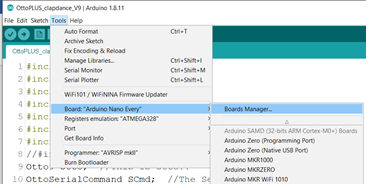

# Setup Arduino Every board in Arduino IDE

1. Board package for Arduino Nano Every:&#x20;

.png>)

Ensure that the board package (Arduino MegaAVR Boards) for Arduino Nano Every is installed. To check, click on Tools > Board > Boards Manager and search for “Every” as shown above. If required, click on the ‘Install’ button to install the board package.

1. Once the board package is installed, select the appropriate board in the Tools menu:
   1. **Tools > Board > Arduino Nano Every**
   2. **Tools > Registry Emulation > ATMEGA328**

