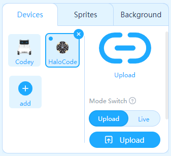
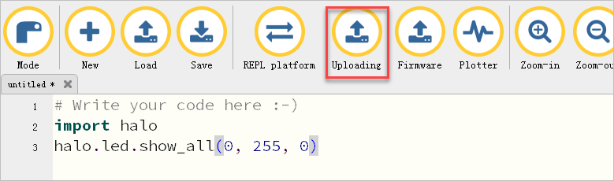
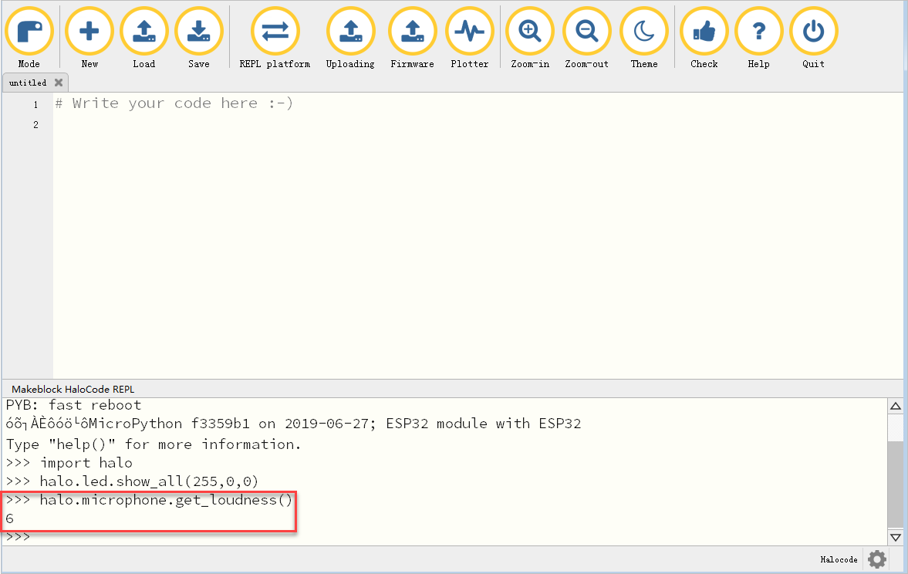
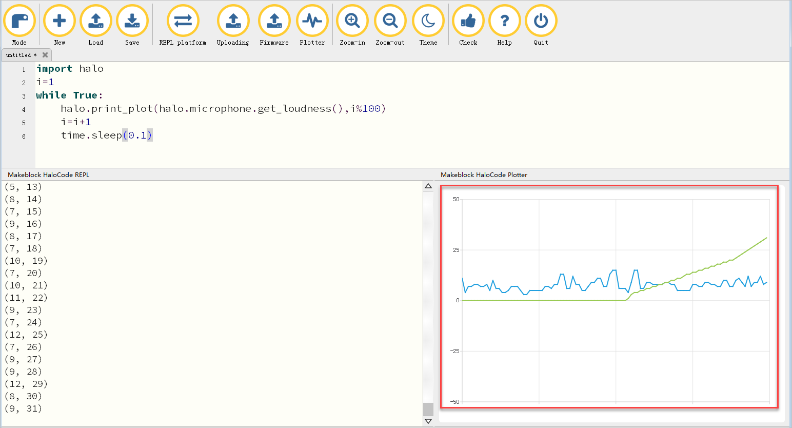

# Code with Mu A Simple Python Editor

\*\*\*\*

Mu is a simple Python editor for beginner programmers. With the support of Mu, you can write Python and Micro Python code in the editor to control the Halocode and its associated electronic modules.

In addition to the basic features of Mu, this version supports more features, like firmware upgrade, code upload, online debugging through the REPL controller, and real-time viewing of variables and sensor values through plotter.

**Preparation Before Use**

Visit the website below to download the latest version of Mu and firmware of Halocode from GitHub: [https://github.com/FFtust/mu/releases/tag/V0.0.1](https://github.com/FFtust/mu/releases/tag/V0.0.1)  Unzip the file **mu-editor.rar** after downloading. 

**Quick Start Guide**

After installation, the programming learning journey will begin!

**1、Hardware Connection**

Connect Halocode to your computer via the Micro USB cable.  Note: You can also connect Halocode to your computer via Makeblock Bluetooth dongle.

**2、Open the Software**

Open the unzipped folder **mu-editor**, then double-click on the the file **.main.exe** to open Mu. 

**3、Select Mode**

From the pop-up Select Mode page, select **Makeblock HaloCode** and click **OK**. 

Note：You can also click **Mode** to select mode.

**4、Update the Firmware**

Before using the Mu editor, you need to use the latest Halocode firmware that we haven't released yet. Click **Firmware** and select the file **firefly\_firmware\_25\_01\_004-ht1.bin** from the pop-up dialog box. You can check the upgrade progress in the lower left corner of the software.  

**5、Start Programming**

Now let's complete a programming task! Try to make the LEDs on the Halocode turn green. Here is the sample code:

import halo

halo.led.show\_all\(0, 255, 0\)

Note：Please refer to [Python API Reference](http://docs.makeblock.com/halocode/en/python-api/python-api.html) to learn more about the function instructions。

**6、Upload Your Program to the Halocode**

Click **Uploading** to upload your program to the Halocode, then check if the LEDs turn green?  

**More Features: Use the REPL Platform to Debug the Program**

**Reporting information**

You can use the **print\(\)** function in your program as long as the Halocode is connected to your computer \(via the Micro USB cable or Makeblock Bluetooth dongle\).Then you can check the real-time returns of **print\(\)** in the REPL platform.

Here is a simple, write the code as shown below and upload it to the Halocode, then click **REPL platform** and check the value of microphone in the platform.

import halo

while True:

 print\(halo.microphone.get\_loudness\("maximum"\)\)

**Sending a Command**

You can also use the platform to debug the program in real time.

Here is a simple, write code in the platform and press the enter key, now check if the LEDs of Halocode turn red?  You can also continue to send commands to check the loudness detected by the microphone: 

**More Features: Plotter**

**Check the variable values in real time**

The plotter can graphically map variable values or sensor output values to make it easier to check the changes of the values.

Here is a simple, write code as shown below and upload it to the Halocode, click **Plotter** to check the value of microphone in real time.

import halo

while True:

 halo.print\_plot\(halo.microphone.get\_loudness\(\)\)

 time.sleep\(0.1\)

Note：When you connect the Halocode to the computer via Makeblock Bluetooth dongle, the plotter may have some delays due to the limit of Bluetooth communication speed.

**Check changes of multiple variables simultaneously**

The plotter supports checking the changes of multiple variables simultaneously.

Here is a simple, write the code as shown below and upload it to the Halocode, then click **Plotter** to check the changes of loudness and i%100.

import halo

i=1

while True:

 halo.print\_plot\(halo.microphone.get\_loudness\(\),i%100\)

 i=i+1

 time.sleep\(0.1\)

**More Documentation**

**Basic documentation**

If you want to implement more features of Halocode and its extension modules in Mu, please refer to [Python API Reference](http://docs.makeblock.com/halocode/en/python-api/python-api.html)。

**Note: We are simplifying our APIs to improve the user experience. \(API is too long to use!\) It will be expected to be completed in August. But we will keep the current APIs as possible as we can though some changes will take place.**

If you are not familiar with Python APIs of halocode, please refer to [Convert Blocks to Python Code](http://docs.makeblock.com/halocode/en/tutorials/use-python.html#convert-blocks-to-python-code).

**Advanced documentation**

The Halocode has powerful performance and networking capabilities, and we provide some sophisticated APIs for you, so you can build exciting hardware projects with the Halocode and its associated electronic modules, and learn from such things as network communication, IoT applications, APP development, etc. But be aware that these features are often more difficult to navigate.

The Halocode has powerful performance and networking capabilities, and we provide some sophisticated APIs for you, so you can build exciting hardware projects with the Halocode and its associated electronic modules, and learn from such things as network communication, IoT applications, APP development, etc. But be aware that these features are often more difficult to navigate.

**network**

Micropython has implemented a network module and provides the corresponding documentation, which can be found at the following link: [http://docs.micropython.org/en/latest/library/network.html](http://docs.micropython.org/en/latest/library/network.html)

Using the APIs in the network will help you make fully use of the Halocode networking capabilities.

**network2**

Using the APIs in the network will help you make fully use of the Halocode networking capabilities.

Default config:

DEFAULT\_AP\_IP = "192.168.4.1"

DEFAULT\_STA\_IP = "192.168.4.2"

DEFAULT\_NETMARK = "255.255.255.0"

DEFAULT\_GATEWAY = "192.168.1.1"

DEFAULT\_DNS = "172.16.50.20"

DEFAULT\_AUTHMODE = AUTH\_WPA2\_PSK

DEFAULT\_PORT = 5050

**API Reference**

network2.config\_ap\(ssid, password\)

Set the Halocode as an AP.

Note: The Halocode can not be AP and STA at the same time currently.

| Parameters: | ssid \(str\) – wifi ssid password\(str\) – wifi password |
| :--- | :--- |
| Returns: | None |

config\_sta\(ssid, password\)

Set the Halocode as an STA.

Note: The Halocode can not be AP and STA at the same time currently.

| Parameters: | ssid \(str\) – wifi ssid password\(str\) – wifi password |
| :--- | :--- |
| Returns: | None |

is\_connected\(\)

Check first whether the Halocode is connected to other devices through WIFI. The API is effective when the Halocode functions as an AP or STA. Therefore, you can always obtain the connection status of the Halocode through this API.

set\_ip\(ip\)

Set the IP address of the Halocode. The Halocode has a default IP address before using this API. DEFAULT\_AP\_IP = "192.168.4.1"  
DEFAULT\_STA\_IP = "192.168.4.2"

| Parameters: | ip \(str\) – ipv4 |
| :--- | :--- |
| Returns: | None |

get\_ip\(\)

Gain Halocode own IP address.

set\_subnet\_mark\(mark\)

Set Halocode subnet mask.

| Parameters: | mark \(str\) – wifi mark, 255.255.255.0 as defualt |
| :--- | :--- |
| Returns: | None |

get\_subnet\_mark\(\)

Get Halocode subnet mask.

set\_gateway\(gw\)

Get Halocode subnet mask.

| Parameters: | gateway \(str\) – |
| :--- | :--- |
| Returns: | None |

get\_gateway\(\)

Get Halocode gateway.

create\_client\(\)

Set Halocode as a client.

client\_connect\_to\(ip\_to, port = DEFAULT\_PORT\)

Connect the Halocode to the server with the specified IP address and port.

create\_server\(port = DEFAULT\_PORT\)

Set Halocode as a server.

server\_wait\_connection\(port = DEFAULT\_PORT\)

This API blocks the thread until a client connects to the server via a specific port, which returns information about the client.

server\_get\_connections\(port = DEFAULT\_PORT\)

Get the IP addresses of all connected clients in list format.

server\_get\_latest\_connection\(port = DEFAULT\_PORT\)

Get the IP address of the client that was last connected.

write\(data, mode, ip\_to, port = DEFAULT\_PORT\)

Send data.

write\_line\(data, mode, ip\_to, port = DEFAULT\_PORT\)

Send data line.

read\(mode, ip\_from, port = DEFAULT\_PORT\)

Accept data.

read\_line\(mode, ip\_from, port = DEFAULT\_PORT\)

Accept data line.

**communication**

We have developed the serial communication interface of the Ring Board, so that you can use these interfaces with a variety of hardware with serial communication capability \(such as Raspberry Pie, some camera modules\) . 

disable\_channel\_default\(channel\)

The Halocode communicates with its electronic module through the hardware serial port. The specific communication protocol is used between the two. If the communication protocol is to be closed, the serial port command of the optical ring board can be “customized”. Please use this instruction.

| Parameters: | channel \(str\) – “uart1/ble” |
| :--- | :--- |
| Returns: | None |

enable\_channel\_default\(channel\)

The Halocode communicates with its electronic module through the hardware serial port. A specific communication protocol is used between the two. To restore the communication command, use this command.

| Parameters: | channel \(str\) – “uart1/ble” |
| :--- | :--- |
| Returns: | None |

read\(channel\)

Read data through a specific channel.

| Parameters: | channel \(str\) – “uart1/ble” |
| :--- | :--- |
| Returns: | bytearray |

send\(channel, data\)

Send data through the set channel.

| Parameters: | channel \(str\) – “uart1/ble” data \(bytearray\) – the data to send |
| :--- | :--- |
| Returns: | bytearray |

