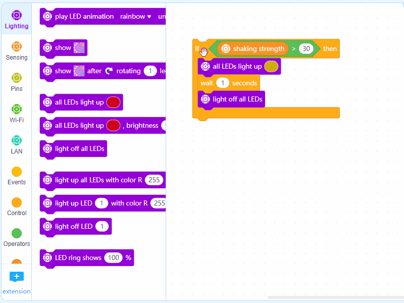

# Compare Strength

****

**Programming Result**

.gif>)

**Introduction to HaloCode's motion sensor**

The motion sensor detects how HaloCode moves, including shaking strength.

.png>)

**Set the range of shaking strength**

1\. Drag an Operators block () > () to the Scripts area, and change the value of the second parameter to "30". Add a Sensing block shaking strength to the first parameter.

.gif>)

2\. Add a Control block if () then ().

.gif>)

**Set LED animation**

3\. Add a Lighting block all LEDs light up (), and a Control block wait () seconds. Add another Lighting block light off all LEDs to light off all LEDs in 1 second.

.gif>)

4\. Likewise, for shaking strength greater than 60, we can duplicate the script. Change the value to 60 and LED color to red.

**Add event and control**

5\. Add an Events block when HaloCode is shaking and a Control block forever.

.gif>)

**Read shaking strength**

6\. Check the box for Sensing block shaking strength.

.gif>)

7\. Shake HaloCode! See if you can make the LED ring light up red.
