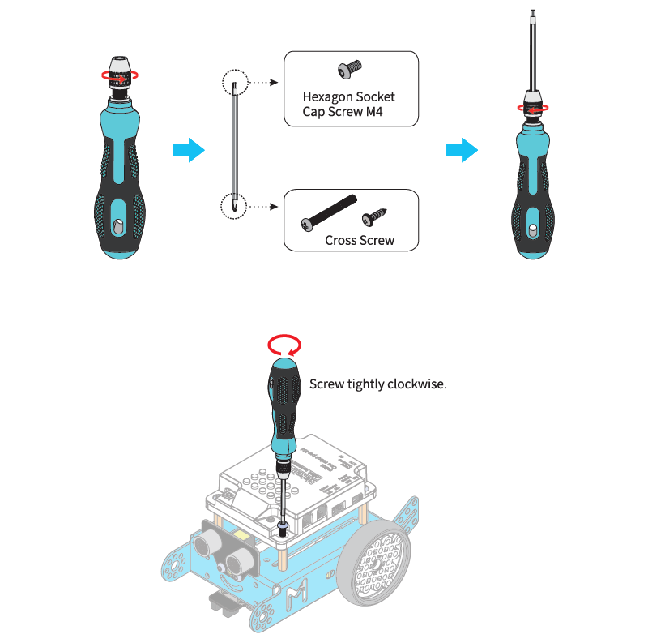

# Make a Smiling Face with the LED Ring

**Programming Result**

**LED ID of HaloCode**

The 12 LEDs of HaloCode share the same position as the twelve hours of a clock.

**Program the "eyes"**

1. Drag two Lighting blocks light up LED \(\) with color R\(\) G\(\) B\(\) to the Scripts area. Set the LED ID to "2", and "10".

**Program the "mouth"**

2. Add 5 Lighting blocks light up LED \(\) with color R\(\) G\(\) B\(\) to the Scripts area. Set the LED ID to "4", "5", "6", "7", and "8" respectively.

3. Add an Events block when button is pressed.

4. Press the button and check HaloCode's smiling face.

