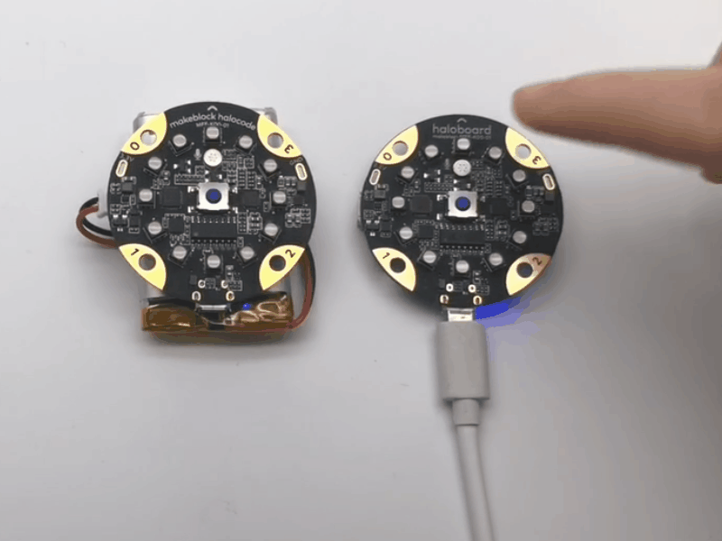

# Control Multiple HaloCodes via LAN

Multiple HaloCodes can join the same LAN (Local Area Network), and communicate with each other. We can use HaloCode to control others.

.png>)

## Control HaloCode B with HaloCode A

### HaloCode A sets up LAN

1\. Connect HaloCode A

.gif>)

2\. Enable Upload mode

.gif>)

3\. Add an Events block when HaloCode starts up, and a LAN block set up LAN named (mesh1)。

.gif>)

### HaloCode A broadcasts on LAN

4\. Add an Events block when button is pressed, and a LAN block broadcast () on LAN. Name the message "light"

.gif>)

5\. Upload the program to HaloCode A

.gif>)

### HaloCode B joins LAN

6\. Connect HaloCode B

.gif>)

7\. Enable Upload mode

.gif>)

8\. Add an Events block when HaloCode starts up, and LAN block join LAN named (mesh1)

### HaloCode B receives LAN broadcast

9\. Add a LAN block when receiving LAN broadcast (), and input "light". Add a Lighting block all LEDs light up (), a Control block wait () seconds, and another Lighting block light off all LEDs

.gif>)

10\. Upload the program to HaloCode B

.gif>)

### Programming result

11\. Press the button HaloCode A

**Challenge**

Challenge yourself. Can you make a new project like following example?

.gif>)
