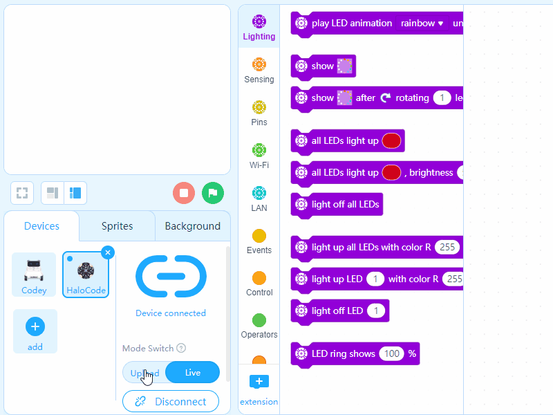

# Deep Learning and Facial Recognition

Use the Machine Learning extension to achieve facial recognition function. When "woman" is recognized, the message "laugh" will be broadcast, and HaloCode will make a smiling face with its LED ring; otherwise, the message "angry" will be broadcast, and the LED ring of HaloCode will light up red. You can apply facial recognition to your smart-home system.

**Training model**

1. Under "Sprites", click "+" in the Blocks area to add "Teachable Machine" extension.

2. Select Teachable Machine blocks, and click "Training model" to build a new model. In this example, we'll need 3 categories.

3. Name the first category "woman". Print a photo of a woman, and place the photo in front of the camera. Click and hold the button "Learn", so that enough samples will be collected. \(Change the angle of the photo to collect different samples; more samples come with better recognition result.\)

4. Likewise, we can collect samples for category "man" and "student".

5. When the sample collecting process is done, click "Use the model".

**Add event and control**

6. Drag an Events block when green flag clicked and a Control block if \(\) then \(\). Then add a Teachable Machine \(TM\) block recognition result is \(woman\).

**Create broadcast messages**

7. Click Events blocks, and create two messages, "laugh" and "angry".

8. Add an Events block broadcast \(laugh\) and wait. \(HaloCode will execute the script that is activated by the message "laugh", and then others.\)

9. Likewise, for "man" and "student", add corresponding Events block broadcast \(\) and wait. Add a Control block forever to keep facial recognition function on.

**Program HaloCode**

10. Under "Devices", choose "HaloCode". Add an Events block when I receive\(\) and two Lighting blocks light up LED \(\) with color R\(\) G\(\) B\(\) to light up the second and tenth LED, as the "eyes" of the smiling face.

11. Add 5 more Lighting blocks light up LED \(\) with color R\(\) G\(\) B\(\) to light up the fourth to eighth LED as the "mouth". Adjust the RGB values to set the color to light pink.

12. Add a Control block wait \(0.1\) seconds and a Lighting block light off all LEDs.

13. Add an Events block when I receive \(angry\) and a Lighting block all LEDs light up \(\). Set the color to red. 0.1 second later, light off all LEDs.

**Programming result**

