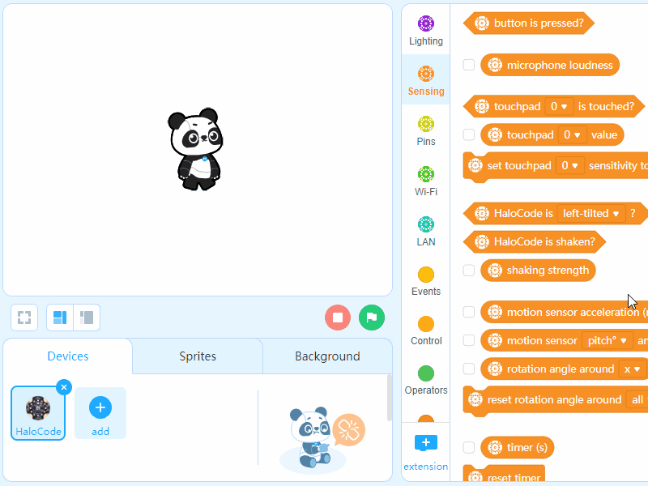

# Emotion Detector

When a happy face is detected, the LED ring of HaloCode will light up, and make a smiling face.

.png>)

**Add a sprite**

1\. Delete default sprite Panda

.gif>)

2\. Add a new sprite, Empty button14

.gif>)

3\. Change the color, and size of the button.

.gif>)

4\. In the Blocks Area, click "+ extension" to add Cognitive Services (AI) blocks

5\. Drag an Events block when this sprite clicked to the Scripts Area. Add an AI block recognize emotion after (1) seconds

.gif>)

6\. Add a Control block ig () then (), an AI block emotion is (happiness)?, and an Events block broadcast (). Create a new piece of message named "laugh"

.gif>)

7\. Check the box of AI block happiness value () to display the value on stage

**HaloCode makes a smiling face**

8\. Add an Events block 当when I receive (laugh), and a Lighting block show (). Draw a smiling face

.gif>)

9\. Add a Control block wait (2) seconds, and a Lighting block light off all LEDs

.gif>)
