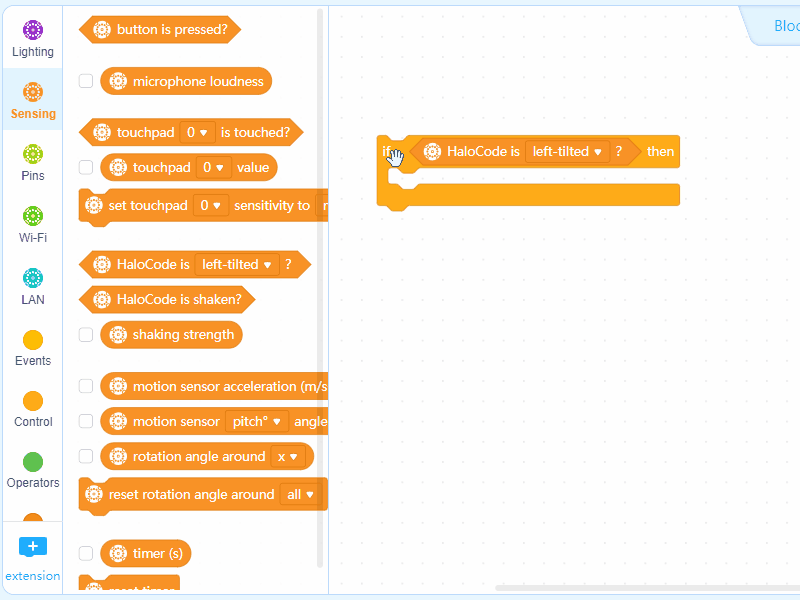
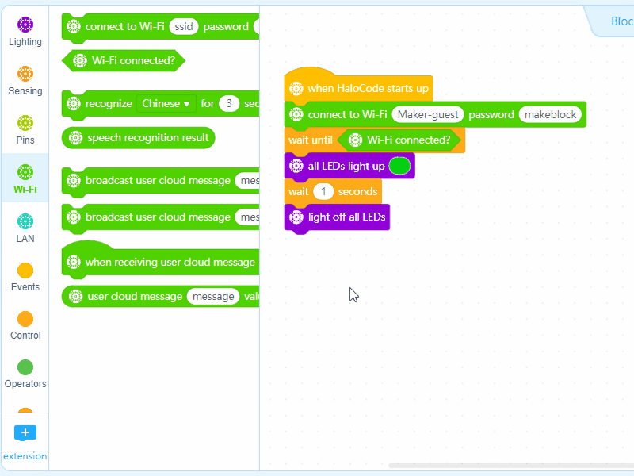

# Remote Control

With Wi-Fi and User Cloud Message, HaloCode can interact with the stage. In this project, we can make a remote control to light up or light off HaloCode's LED ring with stage bulb.

**Enable Upload mode**

**Set the background and sprite**

1. Delete default sprite Panda

2. Under "Background", click "Costumes", and then add background "Office3"

3. Add sprite "bulb", and set the costume to "bulb2"

4. Adjust the size of bulb \(150% of the original size\), and place on the table

**Program bulb**

5. At the bottom of Blocks Area, click "+ extension", and then add User Cloud Message

6. Choose Variables block. Click "Make a Variable", and name it "frequency"

7. Drag an Events block 当when green flag clicked to the Scripts area, and then add a Variables block set \(frequency\) to \(0\)

8. Add an Events block when this sprite clicked, a Variables block change \(frequency\) by \(1\), and a User Cloud Message block send user cloud message \(\) with value \(\). Name the message "switch" and add another Variables block frequency

9. Add a Control block if \(\) then \(\) else \(\), two Operators blocks \(\) = \(\) and \(\) mod \(\), a Variables block frequency. Input "2" and "1"

10. Add two Looks blocks switch costume to \(\), and choose "bulb-1" and "bulb-2" respectively

**HaloCode connects Wi-Fi**

11. Add an Events block when HaloCode starts up, a Wi-Fi block connect to Wi-Fi \(\) password \(\). Input the network name and password of your Wi-Fi

12. Add a Control block wait until \(\), a Wi-Fi block Wi-Fi connected?, a Lighting block all LEDs light up \(\). Set the color to green. Add another Control block wait \(1\) seconds, and another Lighting block light off all LEDs

**HaloCode receives user cloud message**

13. Add a Wi-Fi block when receiving user cloud message \(switch\), a Control block if \(\) then \(\) else \(\), two Operators blocks \(\) = \(\) and \(\) mod \(\), a Wi-Fi block user cloud message \(\) value. Input "2" and "1"

14. Add two Lighting blocks light up all LEDs with color R\(\) G\(\) B\(\) and light off all LEDs

15. Upload the program

