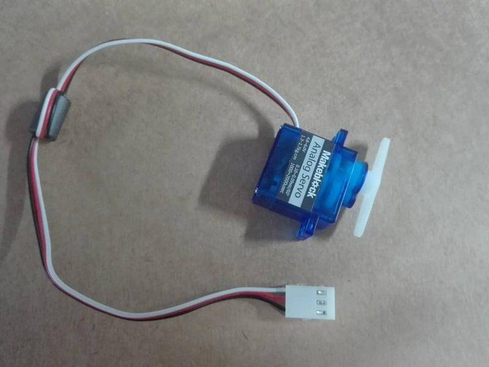
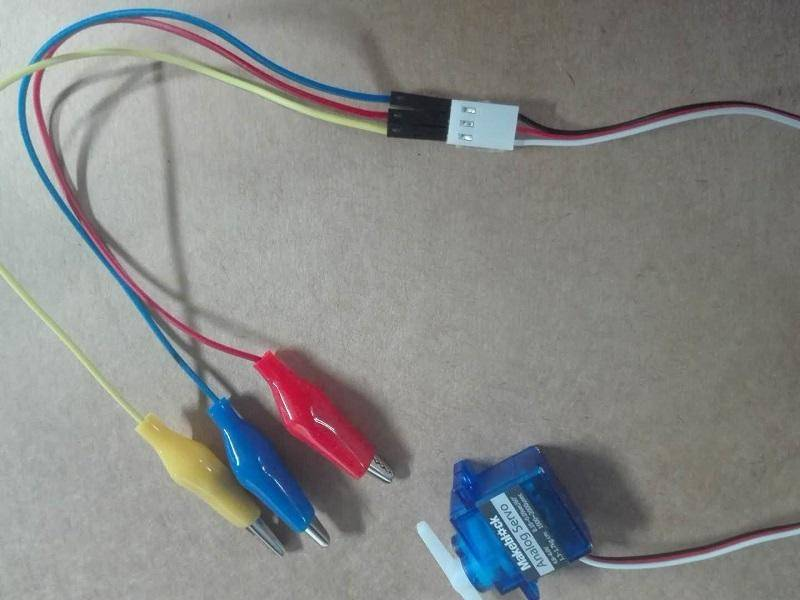
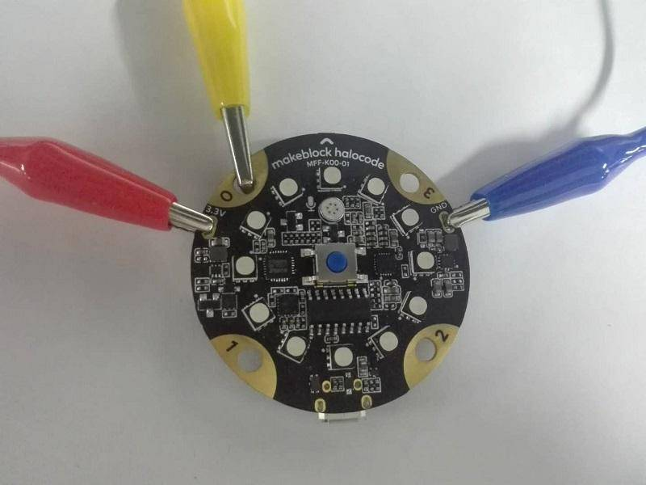
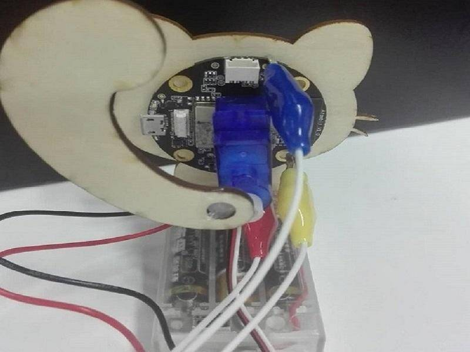
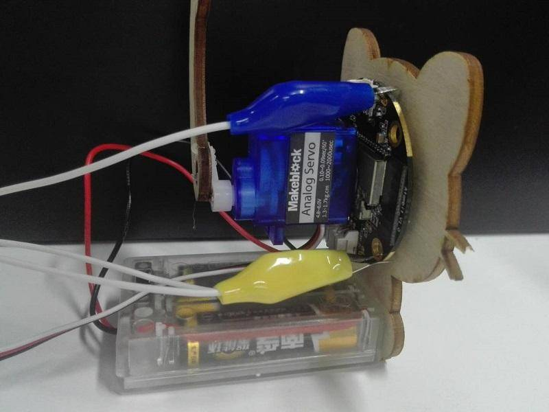
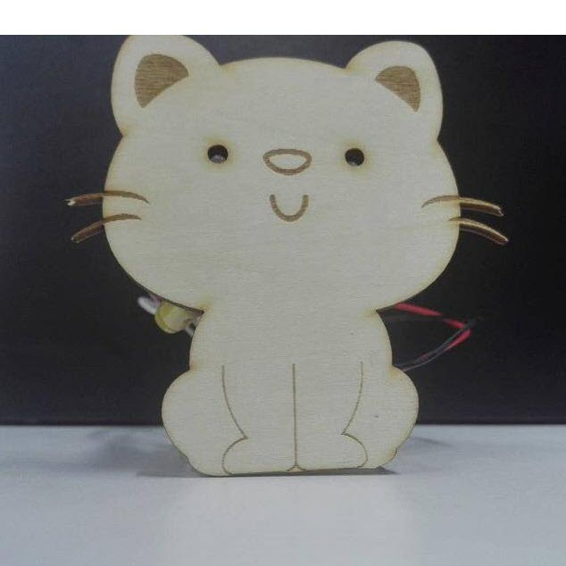

# A Kitten with Blinking Eyes and a Waving Tail

**Tools and materials:**  
one HaloCode, crocodile clip or wire, one battery box, a pair of scissors, one puncher, one ruler, some cardboard, some double-sided tapes, DuPont wire, 9g servo motor \(3.3V\).

**Make a kitten**

Draw the kitten's body and tail on the cardboard, and then cut them out. Use the puncher to make two holes as the eyes of kitten.

**Note: the distance of the two eyes should equal to the greatest distance between two LEDs of HaloCode.**

Connect the servo motor to HaloCode \(any of the four pins will work\), as follows:

* The red line of the servo means the positive pole, and is connected to the red line of the alligator clip, which is connected to the 3.3v pin of HaloCode.
* The black line of the servo means the negative pole, and is connected to the blue line of the alligator clip, which is connected to the GND pin of HaloCode.
* The white line of the servo is the communication line, and is connected to the yellow line of the alligator clip, which can be connected to any touchpad of HaloCode. We'll use touchpad0 in this example.

  

Stick the tail to the servo motor. Connect the body and tail of the kitten with HaloCode, the servo motor, and the battery box.

  

**Toggle on Upload mode**

**Script of Blinking Eyes**

1. Drag an Events block when HaloCode starts up and a Control block forever to the Scripts area.

2. Add a Lighting block all the LEDs light up \(\) and a Control block wait \(\) seconds. Set the color to white. We want the kitten to blink eyes randomly, so we need an Operators block pick random \(\) to \(\), and input number 2 and 6. Add a Lighting block light off all the LEDs and another Control block wait \(\) seconds. Set the time to 0.2 second.

**Script of the Waving Tail**

3. Drag an Events block when HaloCode starts up and a Control block forever to the Scripts area.

4. Add a Pins block servo pin \(\) rotates to \(\) and a Control block wait \(\) seconds. Set the degree to 0 and keep the default time.

5. Add another Pins block servo pin \(\) rotates to \(\) and Control block wait \(\) seconds. Both keep the default value.

6. Click "Upload" to upload the program to HaloCode.

7. Check the kitten! Is it blinking eyes and waving its tail at the same time?

