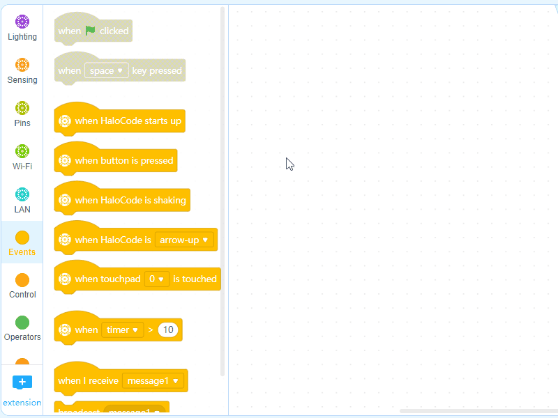
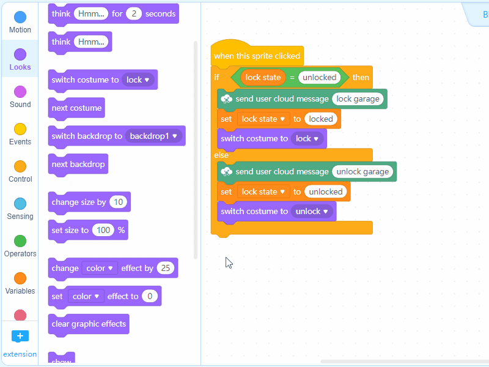
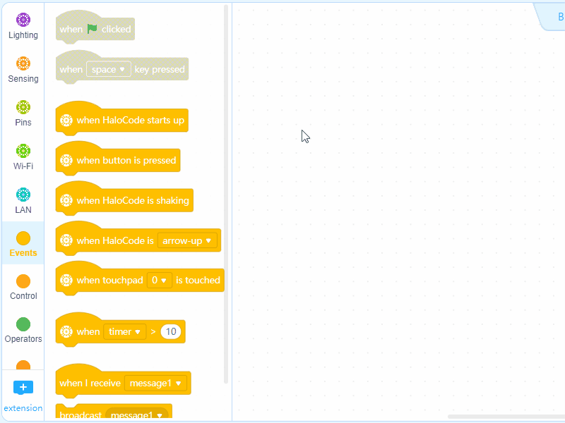

# Pedometer

**Program HaloCode**

1. Create 3 pieces of message: "start", "move", and "stop"

2. Add an Events block when button is pressed , a Control block repeat, another Events block broadcast \(start\), and a Sensing block reset timer

3. Add a Control block if \(\) else \(\), an Operators block \(\) &gt; \(\), a Sensing block shaking strength, and an Events block broadcast \(move\). Input "15" to the second box of the Operators block

4. Add a Control block if \(\) then \(\), an Operators block \(\) = \(\), a Sensing block shaking strength, and an Events block broadcast \(stop\)

5. Add a Control block repeat until \(\), an Operators block \(\) &gt; \(\), and a Sensing block timer. Input "100" to the second box of the Operators block, and combine the two scripts

**Add a sprite**

6. Delete default sprite Panda

7. Add sprite "Empty"

8. Choose "Empty", and then click "Costume". Draw a red dot

9. Duplicate "Empty", and then change the costume to make a blue dot

10. At the bottom of the Blocks Area, click "+ extension" to add Pen

**Program the red dot**

11. Make sure the red dot is selected, and then click Variables blocks. Create a new variable "motion value"

12. Add an Events block when I receive \(move\), and a Control block repeat \(\) times. Input "4"

13. Add a Motion block turn ↷ \(\) degrees , and a Pen block stamp, and a Variables block change \(Motion value\) by \(1\)

14. Add an Events block when I receive \(start\), and a Motion block point in direct \(90\)

**Program the blue dot**

15. Make sure the red dot is selected, and then click Variables blocks. Create a new variable "Slitting value"

16. Add an Events block when I receive \(stop\), and a Control block repeat \(\) times. Input "2"

17. Add a Motion block turn ↷ \(\) degrees , and a Pen block stamp, and a Variables block change \(Slitting value\) by \(1\)

18. Add an Events block when I receive \(start\), and a Motion block point in direct \(90\)

