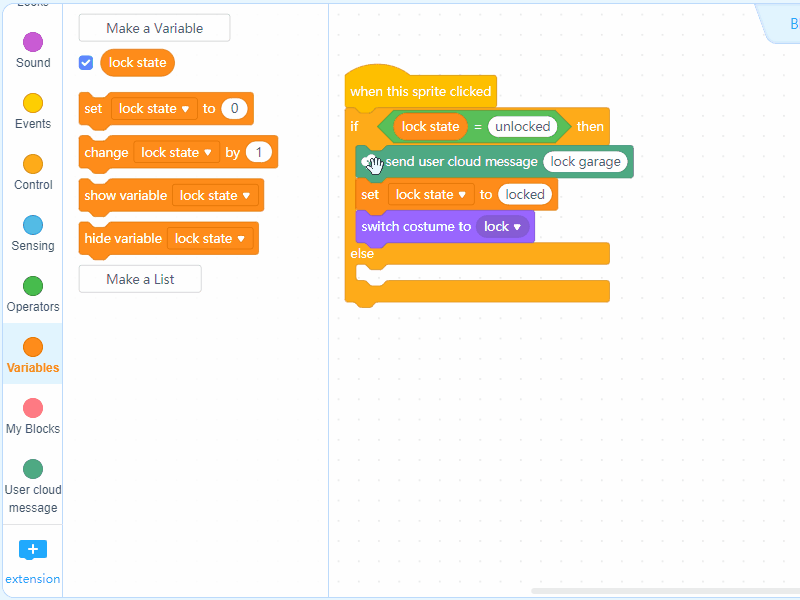
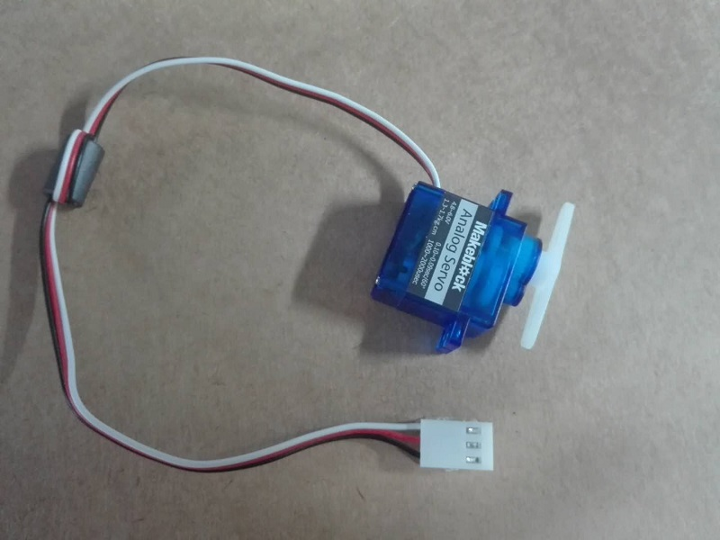

# Smart Home

With built-in Wi-Fi and User Cloud Message, HaloCode can play its role in your smart home. Let's build a house. On the one hand, HaloCode can be the light source of the room; on the other, by connecting to a servo, HaloCode can control garage door.

.png>)

**Set stage background**

1\. Delete default sprite Panda

.gif>)

2\. Under "Background", click "Costumes", and then add "Bedroom2"

.gif>)

**Add a button**

3\. Click "+" under "Sprites", and then add "Empty button1".

.gif>)

4\. Choose "Empty button1". Then click "Costume". Add text "Bright" to the button.

.gif>)

**Program the button**

5\. Under "Sprites", click "+" in the Blocks area to add User Cloud Message blocks.

.gif>)

6\. Add an Events block when this sprite clicked and a User Cloud Message block send user cloud message (). Name the message "bright".

.gif>)

7\. Add some special effects to the button when it is clicked. Drag two Looks block change size by (10) and change (color) effect by (5). Then add a Control block wait () seconds, and set the value to 0.1.

.gif>)

8\. Add another two Looks blocks set size to (100)% and set (color) effect to (0).

.gif>)

**Add buttons: "Soft", "Night", and "Colorful"**

9\. Duplicate "Empty button1" to make create another button for soft light, and edit the program accordingly. Likewise, we can create two more buttons for "night" and "colorful".

.gif>)

.png>)

**Add garage button**

10\. Under "Sprites", click "+" to add "Blue button45". Add text "garage lock" to the button.

.gif>)

11\. Choose "Blue button45", and then click "Costumes". Duplicate the costume. Edit the costume. Name the two costumes "lock", and "unlock"

.gif>)

**Program garage button**

12\. Choose Variables blocks, and click "Make a Variable". Name the variable "lock state".

.gif>)

13\. Add an Events block when this sprite clicked, a control block if () then () else (), an Operators block () = (), and a Variables block lock state. Input "unlocked" to the second slot of the Operators block

.gif>)

14\. When the door is open, we want to close the door. Add a User Cloud Message block send user cloud message (), and name the message "lock garage". Add a Variables block set (lock state) to (locked) and a Looks block switch to costume(lock).

.gif>)

15\. Duplicate the script, to open garage lock. Change the variables accordingly.

16\. Add some special effects to the button when it is clicked. Add the following blocks: change size by (10), change (color) effect by (5), set size to (100)%, wait () seconds, and set (color) effect to (0).

**Connect to the internet**

17\. To use User Cloud Message, we have to connect HaloCode to the internet. Add two blocks: when HaloCode starts up, and connect to Wi-Fi () password ().

18\. Add some special effects to HaloCode when successfully connected to the internet

**Add light effect**

19\. Add a Wi-Fi block when receiving user cloud message (), and input "bright". Add a Lighting block all LEDs light up (), brightness ()%, to light up all LEDs white.

20\. Likewise, for User Cloud Message "soft", all LEDs will light up 40% white.

21\. For User Cloud Message "night", fewer LEDs will light up. Add a Wi-Fi block when receiving user cloud message () and a Lighting block show ().

22\. For User Cloud Message "colorful". the LED right will light up with multiple colors. We'll need these blocks: show (), wait () seconds, light off all LEDs, and repeat ().

**Connect second HaloCode to the servo**

23\. The red line of the servo means the positive pole, and is connected to the red line of the alligator clip, which is connected to the 3.3v pin of HaloCode. The black line of the servo means the negative pole, and is connected to the blue line of the alligator clip, which is connected to the GND pin of HaloCode. The white line of the servo is the communication line, and is connected to the yellow line of the alligator clip, which can be connected to any touchpad of HaloCode. We'll use touchpad0 in this example.

**Program the servo**

24\. Add a Wi-Fi block when receiving user cloud message (), and input message "lock garage". Add a Pins block servo pin () rotates to () (actual rotating degree depends on the angle of the servo), to close the door.

24\. Add another Wi-Fi block when receiving user cloud message (), and input message "unlock grage". Add a Pins block servo pin () rotates to () (actual rotating degree depends on the angle of the servo), to open the door.

**Programming result**

26\. Upload program.
