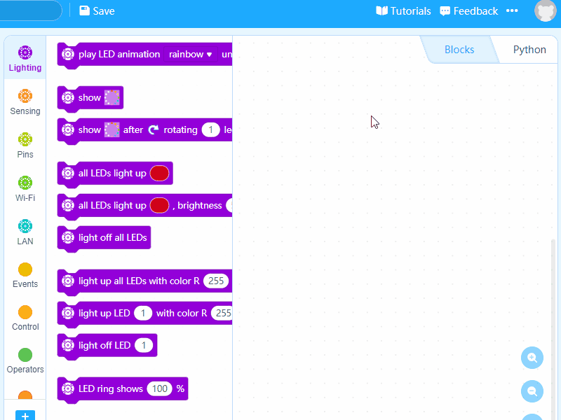

# Speech Recognition

With HaloCode's microphone and built-in Wi-Fi, we can make a simple speech recognition application. The internet enables HaloCode to use Microsoft's speech recognition service. You need to sign in/up to mBlock 5 to connect your HaloCode to the internet.

**Sign in to mBlock 5**

HaloCode needs to connect to the internet to use online speech recognition service. We need to sign in to mBlock 5 first.

**Toggle on Upload mode**

Click to toggle on Upload mode.

.gif>)

**Connect to the internet**

1\. Drag an Events block when HaloCode starts up and a Wi-Fi block connect to Wi-Fi () password (). Input the Wi-Fi name and password.

.gif>)

2\. We want to know when the Wi-Fi is successfully connected. Add a Control block wait (), a Wi-Fi block Wi-Fi is connected?, and a Lighting block all LEDs light up ().

.gif>)

**Speech recognition**

When the button is pressed, HaloCode will start speech recognition and all LEDs will light up white. The recognition process lasts for 3 seconds. When it's done, all LEDs will go off as a signal.

3\. Add an Events block when button is pressed and a Lighting block all LEDs light up (). Change the color to white. Then add a Wi-Fi block recognize (English) for (3) seconds.

.gif>)

4\. Add a Lighting block light off all LEDs to light off all LEDs after the speech recognition is done.

.gif>)

**Recognize "red"**

5\. Add a Control block if () then () and an Operators block () contains ()?. Add Wi-Fi block speech recognition result to the first box and input "red" to the second box.

.gif>)

6\. If the speech recognition result contains "red", all LEDs will light red, and go off in 1 second. Add these blocks: all LEDs light up (), wait () seconds, and light off all LEDs.

.gif>)

7\. Click "Upload" to upload the program to HaloCode.

.gif>)

8\. Wait until all the LEDs light up green. Then press the button and say "red". Check the LEDs of HaloCode.
