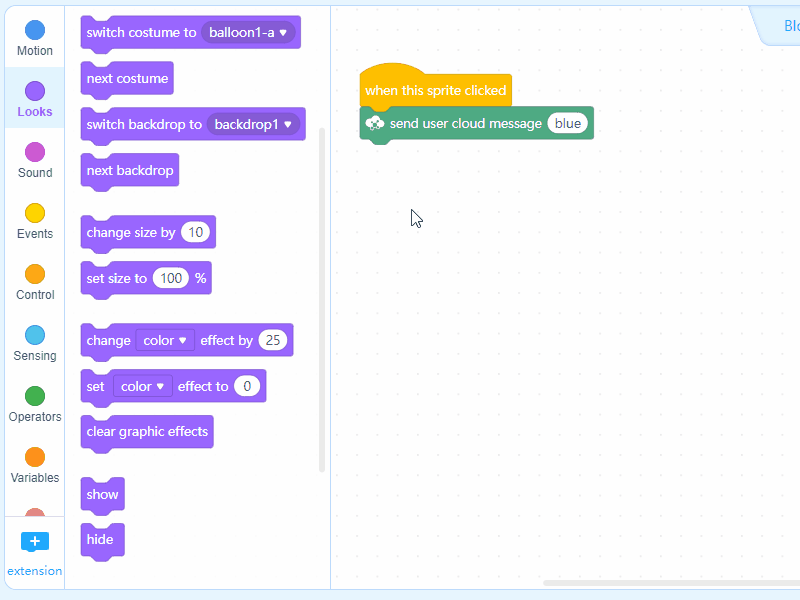

# Get Started

This section includes a quick start guide to HaloCode.

**Connect HaloCode**

1. Under "Devices", click "+" to add device.

2. From the pop-up Device Library page, select "HaloCode" and click "OK".

**Tip:**  
☛ Click ☆ to set HaloCode as the mostly used device.  

3. Use a micro-USB cable to connect your HaloCode to a USB port of your computer.

4. Under "Devices", choose "HaloCode", and click "Connect".

5. The Device Connection window will pop up. The serial port of HaloCode will automatically be detected. Please click "Connect".

6. Toggle on Upload Mode.

**Create a HaloCode Project**

Let's start with a simple project. When we shake HaloCode, the LED ring will light up and then go off.

1. Drag an Events block when HaloCode is shaking to the Scripts area.

2. Add a Lighting block show \(\) to control the LED ring of HaloCode.

3. Add a Control block wait \(\) seconds, and a Lighting block light off all the LEDs to make the LED ring go off after 1 second.

4. Click "Upload" to upload the program to HaloCode.

5. Try shaking HaloCode!

n

