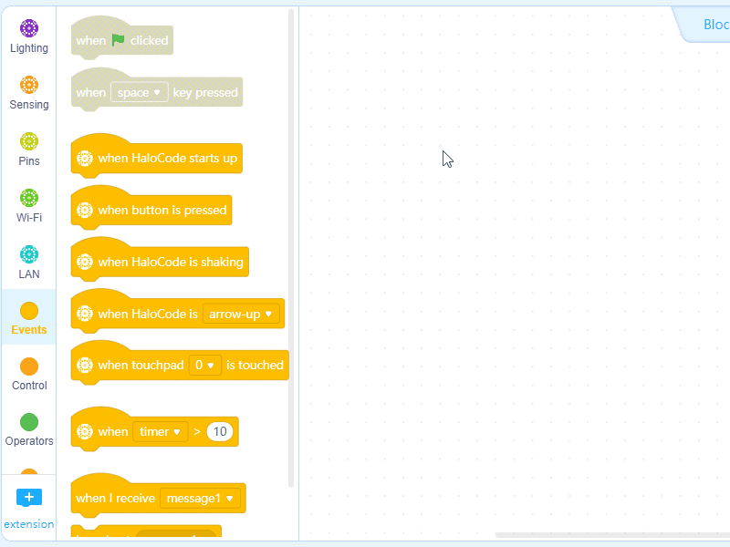

# User Cloud Message

User Cloud Message syncs your data across devices with your mBlock 5 account. As long as your HaloCode is connected to the internet, you can program it remotely.

**Sign UP / Sign In to mBlock 5**

Click the sign in/sign up icon at the tool bar, and then follow the instructions to finish signing up or signing in.

**Toggle on Upload mode**

Click to toggle on Upload mode.

**Use Stage Button to Control HaloCode Remotely**

We will create a new project combined with Scratch Stage Programming. Use the button on stage to control HaloCode remotely.

**Add User Cloud Message Blocks**

Under "Sprites", click "+" in the Blocks area. The Extension Center page will pop up. Click "Add" to add User Cloud Message blocks.

**Step One: Program Stage Button**

1. Under "Sprites", click "×" to delete "Panda" \(the default sprite\).

2. Click "+" to add a new sprite. From the pop-up Sprite Library page, search and choose "Empty Button1". Click "OK".

3. Choose "Empty Button1", and drag an Events block when this sprite clicked to the Scripts area.

4. Add a User Cloud Message block send user cloud message \(\) and name the message "light\_on".

5. Let's add some special effects to the button. Add a Motion block change y by \(\) and set the value to "-2". Add a Looks block set color effect to \(\) and set the value to "-10".

6. Add a Control block wait \(\) seconds and input "0.2". Drag another Motion block change y by \(\) and set the value to "-2". Then add another Looks block set color effect to \(\).

**Step Two: Program HaloCode**

**Connect to the Internet**

1. Under "Devices", make sure "HaloCode" is selected. Drag an Events block when HaloCode starts up to the Scripts area. Add a Wi-Fi block connect to Wi-Fi \(\) password \(\). Input Wi-Fi SSID \(Wi-Fi name\) and password.

2. To ensure Wi-Fi is successfully connected, we need to add a Control block wait \(\) and a Wi-Fi block Wi-Fi is connected?. We want to know when Wi-Fi is connected, so let's add a Lighting block all LEDs light up \(\) to make the LED ring lights up green.

**Cloud Message Script**

When HaloCode receives the user cloud message "light\_on", we want the LED ring to light up red and then go off.

1. Drag a Wi-Fi block when receiving user cloud message \(\) and input "light\_on". Add a Lighting block all LEDs light up \(\) and set the color to red.

3. Add a Control block wait \(\) seconds and a Lighting block light off all LEDs.

4. Click "Upload" to upload the program to HaloCode.

5. Try clicking "Empty Button1" on the stage!

As long as HaloCode is connected to the internet, you can sign in to mBlock 5 in another computer and open the same project to control HaloCode remotely.

