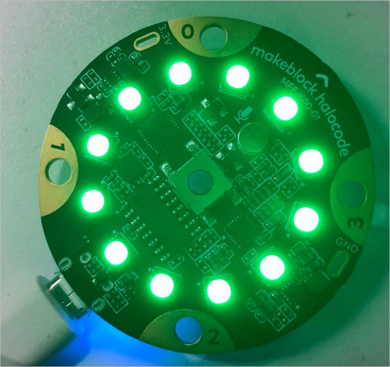

# Control

**1. wait \(\) seconds**

Waits for a specified period of time to run the script.

**Example:**

When the space key is pressed, all LEDs will light up red, and 1 second later, switch to yellow.

**2. repeat \(\)**

Runs the script for the specified number of times.

**Example:**

When the space key is pressed, all LEDs will switch between red and yellow for 10 times.

**3. forever**

Runs the script repeatedly.

**Example:**

When the space key is pressed, all LEDs will switch between red and yellow.

**4. if \(\) then \(\)**

If the report condition is met, run the script.

**Example:**

When the green flag is clicked, if the on-board button is pressed, all LEDs will light up red.

**5. if \(\) then \(\) else \(\)**

If the report condition is met, run script 1. If not, run script 2.

**Example:**

When the space key is pressed, if the on-board button is pressed, all LEDs will light up red, else, green.

**6. wait \(\)**

Wait until the report condition is met. Then run the script.

**Example:**

When the green flag is clicked, if the on-board button is pressed, all LEDs will light up red.

**7. repeat until \(\)**

Run the script repeatedly until the report condition is met.

**Example:**

When the green flag is clicked, all LEDs will light up red until the on-board button is pressed.

**8. stop \(\)**

Stop the specified script or scripts. There are three options: all, this script, or other scripts in sprite.

**Example:**

When the space key is pressed, all scripts will stop.

