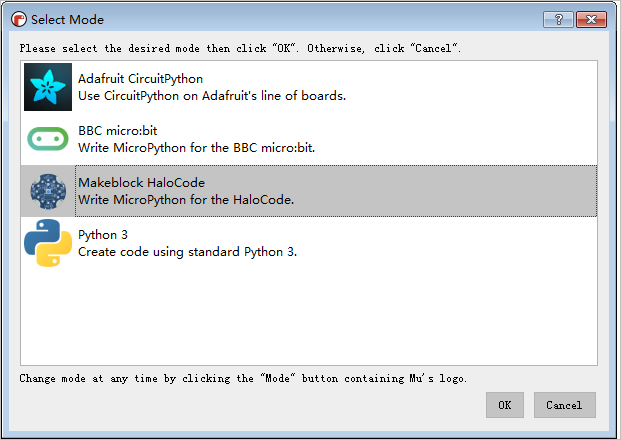

# Events

**1. when green flag clicked**

When the green flag is clicked, run the script.

**Example:**

When the green flag is clicked, the specified image will be displayed on the external LED panel.

**2. when \(space\) key pressed**

When the specified key is pressed, run the script.

**Example:**

When the space key is pressed, the specified image will be displayed on the external LED panel.

**3. when on-board button \(pressed\)**

When the on-board button is pressed or released, run the script.

**Example:**

When the on-board button is pressed, all LEDs will light up red.

**4. when I receive \(message1\)**

When the specified message is received, run the script.

**Example:**

When "message1" is received, mBot will move forward at 50% power for 1 second.

**5. broadcast \(message1\)**

Broadcasts the specified message.

**Example:**

When the space key is pressed, "message1" will be broadcast.

**6. broadcast \(message1\) and wait**

Broadcasts the specified message and waits until all the scripts activated by this broadcast end.

**Example:**

When the space key is pressed, "message1" will be broadcast and the next script will be executed when all the scripts activated by this broadcast end.

