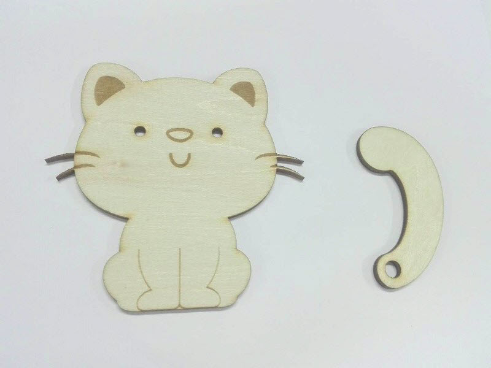
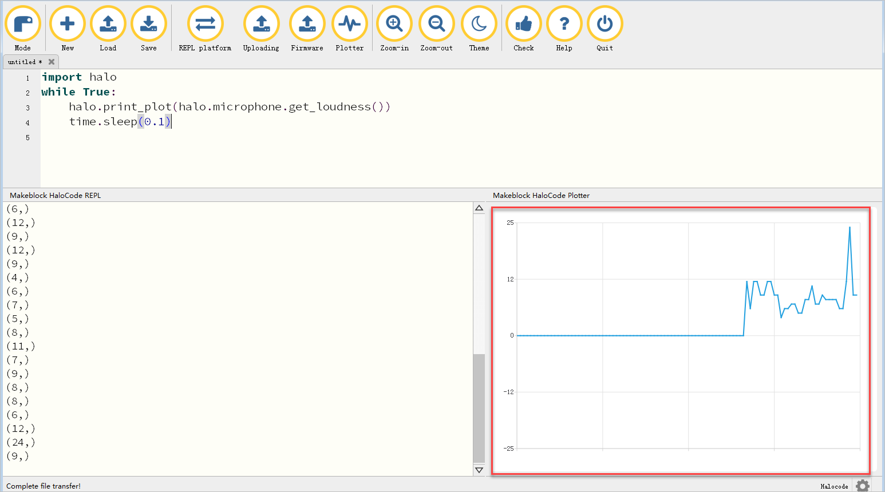

# Looks

Add a LED matrix display to mBot to make it cuter and more playable.

Use a RJ25 cable to connect the LED matrix to a RJ25 port of the main board.

**Coordinate of the Face Panel**

As shown in the figure above, the face panel has the upper-left corner as the origin of the coordinate system, and the direction of x and y is indicated by the arrow. Parameters:

* x: -15 ~ 15
* y: -7 ~ 7

**1. LED panel \(port1\) shows image \(\) for \(\) secs**

Displays the specified image on mBot's screen that is connected to the specified port of the main board for the specified amount of seconds.

**Example:**

When the space key is pressed, the LED panel connected to port1 will display the specified image for 1 second.

**2. LED panel \(port1\) shows image \(\)**

Displays the specified image on mBot's screen that is connected to the specified port of the main board.

**Example:**

When the space key is pressed, the LED panel connected to port1 will switch between the two specified images for 10 times, with the time gap of 1 second.

**3. LED panel \(port1\) shows image \(\) at x:\(\) y:\(\)**

Displays the specified image on mBot's screen that is connected to the specified port of the main board at the specified position.

**Example:**

When the space key is pressed, the LED panel connected to port1 will display the specified image at \(0,0\).

**4. LED panel \(port1\) shows text \(\)**

Displays the specified text on mBot's screen that is connected to the specified port of the main board.

**Example:**

When the space key is pressed, the LED panel connected to port1 will display "hello".

**5. LED panel \(port1\) shows text \(\) at x:\(\) y:\(\)**

Displays the specified text on mBot's screen that is connected to the specified port of the main board at the specified position.

**Example:**

When the space key is pressed, the LED panel connected to port1 will display "hello" at \(0,0\).

**6. LED panel \(port1\) shows number \(\)**

Displays the specified number on mBot's screen that is connected to the specified port of the main board.

**Example:**

When the space key is pressed, the LED panel connected to port1 will display "2019".

**7. LED panel \(port1\) shows time \(\):\(\)**

Displays the specified time on mBot's screen that is connected to the specified port of the main board.

**Example:**

When the space key is pressed, the LED panel connected to port1 will display time "15:30".

**8. LED panel \(port1\) clears screen**

Clears the screen that is connected to the specified port of the main board.

**Example:**

When the space key is pressed, the content on mBot's external screen will be cleared.

