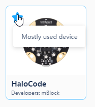
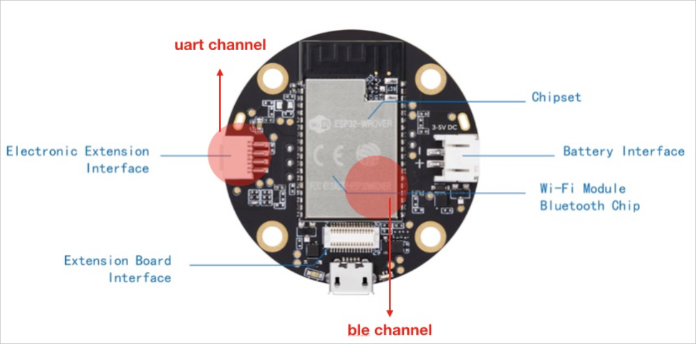
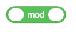

# Operators

**1. \(\) + \(\)**

Performs mathematical addition.

**Example:**

When the space key is pressed, the external LED panel will display the result of "2 + 3".

**2. \(\) − \(\)**

Performs mathematical subtraction.

**Example:**

When the space key is pressed, the external LED panel will display the result of "3 - 1".

**3. \(\) \* \(\)**

Performs mathematical multiplication.

**Example:**

When the space key is pressed, the external LED panel will display the result of "2 × 3".

**4. \(\) / \(\)**

Performs mathematical division.

**Example:**

When the space key is pressed, the external LED panel will display the result of "6 ÷ 2".

**5. pick random \(\) to \(\)**

Picks a random number from the specified range.

**Example:**

When the space key is pressed, the external LED panel will display the image for a random number of seconds within the range of 1 to 10.

**6. \(\) &gt; \(\)**

If the value of the specified parameter is greater than the specified value, the report condition is met.

**Example:**

When the green flag is clicked, if the light intensity is greater than 50, all LEDs will light up red.

**7. \(\) &lt; \(\)**

If the value of the specified parameter is less than the specified value, the report condition is met.

**Example:**

When the green flag is clicked, if the light intensity is smaller than 50, all LEDs will light up red.

**8. \(\) = \(\)**

If the value of the specified parameter equals the specified value, the report condition is met.

**Example:**

When the greed flag is clicked, if the distance of obstacle detected by the ultrasonic sensor equals 50 cm, all LEDs will light up red.

**9. \(\) and \(\)**

If both the conditions are met, the report condition is met.

**Example:**

When the greed flag is clicked, if the on-board button is released, and button A of the IR remote is pressed, all LEDs will light up red.

**10. \(\) or \(\)**

If either one of the two conditions is met, the report condition is met.

**Example:**

When the greed flag is clicked, if either the on-board button is pressed, or button A of the IR remote is pressed, all LEDs will light up red.

**11. not \(\)**

The report condition is met when the specified condition is not met.

**Example:**

When the greed flag is clicked, if the on-board button is not pressed, all LEDs will light up red.

**12. join \(\) \(\)**

Join two specified character strings.

**Example:**

When the space key is pressed, the external LED panel will display "hi" and "morning" together.

**13. letter \(\) of \(\)**

Report the letter at specified position of a character string.

**Example:**

When the space key is pressed, the external LED panel will display the third letter of "morning".

**14. length of \(\)**

Report the length of a specified character string.

**Example:**

When the space key is pressed, the external LED panel will display the length of "morning."

**15. \(\) contains \(\)?**

If the specified character string contains the other specified character string, the report condition is met.

**Example:**

When the green flag is clicked, if "apple" contains "a", all LEDs will light up red.

**16. \(\) mod \(\)**

Calculate the remainder \(modular\) of two specified numbers.

**Example:**

When the space key is pressed, the external LED panel will display the remainder of "9 ÷ 6".

**17. round \(\)**

Round the specified number to nearest integer.

**Example:**

When the space key is pressed, the external LED panel will display the rounded value of 10.7.

**18. \(abs\) \(\)**

Perform specific mathematical operation on the specified number. Mathematical operations include: abs \(absolute value\), floor, ceiling, sqrt \(square root\), sin, sos, tan, asin, atan, acos, ln, log, e^, and 10^.

**Example:**

When the space key is pressed, the external LED panel will display the square root of 16.

