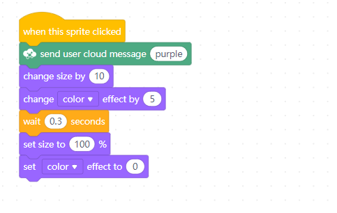

# Sensing

**1. light sensor \(on-board\) light intensity**

Reports light intensity by the specified light sensor.

**Example:**

When the space key is pressed, the light intensity value will be displayed on the external LED panel.

**2. ultrasonic sensor \(port3\) distance cm**

Reports the distance of obstacles detected by the ultrasonic sensor that is connected to the specified port.

**Example:**

When the space key is pressed, the distance of obstacles detected by the ultrasonic sensor will be displayed on the external LED panel.

**3. line follower sensor \(port2\) value**

Reports the value detected by the specified line follower sensor.

**Example:**

When the space key is pressed, the value detected by the line follower sensor will be displayed on the external LED panel.

**4. line follower sensor \(port2\) detects \(leftside\) being\(black\)?**

If the color detected by the specified line follower sensor on the specified side is the specified color, the report condition is met.

**Example:**

When the green flag is clicked, if the line follower sensor detects black obstacles on the left side, mBot will stop moving.

**5. when on-board button \(pressed\)?**

If the on-board button is pressed or released, the report condition is met.

**Example:**

When the green flag is clicked, if the on-board button is pressed, the LEDs of mBot will light up red.

**6. IR remote \(A\) pressed?**

If the specified button of the IR remote is pressed, the report condition is met.

**Example:**

When the green flag is clicked, if button A of the IR remote is pressed, "yes" will be displayed on the external LED panel.

**7. send IR message \(hello\)**

Sends the specified IR message.

**Example:**

When the space key is pressed, IR message "hello" will be sent out.

**8. IR message received**

Reports the received IR message.

**Example:**

When the space key is pressed, the IR message received will be displayed on the external LED panel.

**9. timer**

Reports the value of the timer.

**Example:**

When the space key is pressed, the value of the timer will be displayed on the external LED panel.

**10. reset timer**

Resets the timer.

**Example:**

When the space key is pressed, the timer will be reset.

