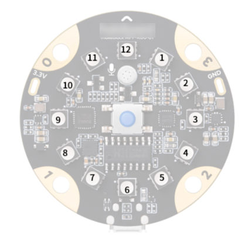

# Show

**LEDs of mBot**

There are two on-board RGB LEDs, as shown in the image above.

**1. LED \(all\) shows color \(\) for \(\) secs**

Lights up the specified LED/LEDs the specified color for the specified amount of seconds. There are three options: all LEDs, left LED, or right LED.

**Example:**

When the space key is pressed, both LEDs will light up red for 1 second.

**2. LED \(all\) shows color \(\)**

Lights up the specified LED/LEDs the specified color. There are three options: all LEDs, left LED, or right LED.

**Example:**

When the space key is pressed, both LEDs will switch between red and yellow for 10 times, with the time gap of 1 second.

**3. turn on \(all\) light with color red\(\) green\(\) blue\(\)**

Lights up the specified LED/LEDs the specified color, mixed by specified RGB color values. There are three options: all LEDs, left LED, or right LED.

**Example:**

When the space key is pressed, both LEDs will light up red.

**4. play note \(C4\) for \(\) beats**

Plays the specified note for the specified number of beats.

**Example:**

When the space key is pressed, the note C4 will be played for 0.25 beat.

**5. play sound at frequency of \(\) Hz for \(\) secs**

Plays sound at the specified frequency for the specified amount of time.

**Example:**

When the space key is pressed, the sound at frequency 700 Hz will be played for 1 second.

