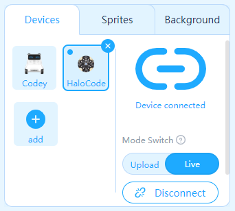

# Building mBot

**Building mBot**

* [Parts list](http://docs.makeblock.com/mbot/en/tutorials/building.html#parts-list)
* [Use of screwdriver](http://docs.makeblock.com/mbot/en/tutorials/building.html#use-of-screwdriver)
* [Main board](http://docs.makeblock.com/mbot/en/tutorials/building.html#main-board)
* [Building instructions](http://docs.makeblock.com/mbot/en/tutorials/building.html#building-instructions)

**Parts list**

**Use of screwdriver**

**Main board**

**Building instructions**

