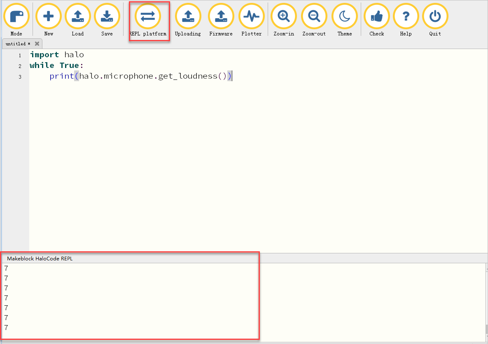

# Connect mBot

You can connect mBot to mBlock 5 via the USB or Bluetooth 4.0.

* [Method one: via the USB](http://docs.makeblock.com/mbot/en/tutorials/connect.html#method-one-via-the-usb)
* [Method two: via Bluetooth 4.0](http://docs.makeblock.com/mbot/en/tutorials/connect.html#method-two-via-bluetooth-40)

**Method one: via the USB**

1. Use the USB Cable that came with mBot to connect your mBot to a USB port on you computer.

2. Power on your mBot.

3. Under "Devices", click "add", and choose "mBot" from the pop-up Device Library window.

→ 

4. Click "Connect", and from the pop-up device connection window, click "Connect" under "USB".

→ 

**Method two: via Bluetooth 4.0**

System requirements:

* **Windows**: the version of Bluetooth must be 4.0; for other Bluetooth versions, a Bluetooth 4.0 adapter is recommended \(refer to [Bluetooth 4.0 Adapter](http://www.mblock.cc/doc/en/part-one-basics/connect-devices.html#3-bluetooth-40-instructions-for-windows-users) for detailed instructions\)
* **Mac OS**: support most Mac OS models

1. Power on your mBot.

2. Turn on the Bluetooth on your PC.

* Windows: on the task bar, select **action center** &gt; **Bluetooth**
* Mac OS: choose **Apple menu** &gt; **System Preferences**, then click **Bluetooth**

3. Under "Devices", click "add", and choose "mBot" from the pop-up Device Library window.

→ 

4. Click "Connect", and from the pop-up device connection window, click "Connect" under "Bluetooth 4.0".

→ 

