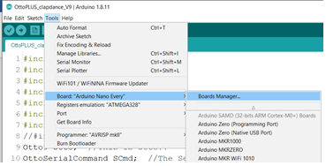
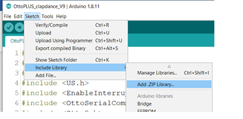
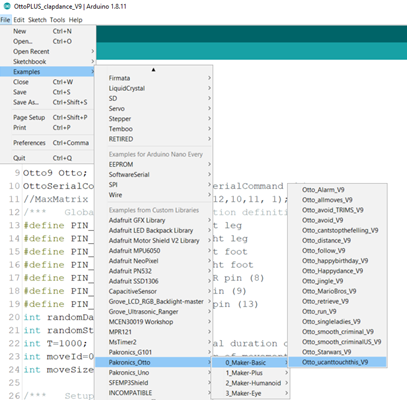

# User guide

Pakronics® sells Otto-DIY robots with Arduino _**Nano Every**_ boards. While both boards and pin-wise compatible, there are few differences between the two Arduino variants, as listed below:

| Parameter | Arduino Nano | Arduino Nano Every |
| :--- | :--- | :--- |
| Processor | ATmega328P | ATmega4809 |
| Flash | 32KB | 48KB |
| SRAM | 2KB | 6KB |
| EEPROM | 256B | 1024B |

## Otto Kit variants:

Otto-DIY Robot Kits are available in the following four variants depending upon the mechanical and electronic components:

| Parts \| Variants | Maker | Maker+ | Humanoid | Eye/LED |
| :--- | :--- | :--- | :--- | :--- |
| Arduino | X | X | X | X |
| Shield | X | X | X | X |
| Servos | 4 | 4 | 6 | 4 |
| Buzzer | X | X | X | X |
| Switch | X | X | X | X |
| Ultrasonic Sensor | X | X | X |  |
| Touch Sensor |  | 3 | 1 | 1 |
| Sound Sensor |  | X | X |  |
| Bluetooth |  | X | X |  |
| Accelerometer |  |  | X |  |
| LED Matrix \(8x8\) |  |  | X |  |
| LED Matrix \(16x8\) |  |  |  | X |

## Setting up Arduino Software

Following are the tips to work with Otto-DIY Maker Robot from Pakronics®:

1. Board package for Arduino Nano Every:

 

Ensure that the board package \(Arduino MegaAVR Boards\) for Arduino Nano Every is installed. To check, click on Tools &gt; Board &gt; Boards Manager and search for “Every” as shown above. If required, click on the ‘Install’ button to install the board package.

1. Once the board package is installed, select the appropriate board in the Tools menu:
   1. Tools &gt; Board &gt; Arduino Nano Every
   2. Tools &gt; Registry Emulation &gt; ATMEGA328
2. Otto Library for Arduino
   1. Download the Pakronics Otto-DIY library \(Pakronics\_Otto.zip file\) for _**Arduino Every**_ from - [https://learn.pakronics.com.au/otto-diy/code\#arduino-every-code](https://learn.pakronics.com.au/otto-diy/code#arduino-every-code)
   2. To install the library, click on Sketch &gt; Include Library &gt; Add .zip library and select the downloaded zip file.

* 1. Once the library is installed, you will be able to access and run the example codes provided for each Otto-Maker variant \(File &gt; Examples &gt; Pakronics\_Otto\)

## Connection of components – Otto Robot Assembly

Across all the four variants of Otto-DIY Robots, buzzer, switch and Servos are common. Following the connection guide:

* Servos
  * 4 servos for foot and legs are connected to pin 2, 3, 4 and 5 respectively
  * 2 servos for hands \(Humanoid only\) are connected to pin 6 and 7
* Buzzer is connected to pin 13
* Battery switch is connected with Vin and Ground to supply the Arduino board through battery power.
* Ultrasonic sensor is connected to pin 9 \(Maker, Maker+ and Humanoid\)
* Sound sensor is connected to Analog pin A6 \(Maker+ and Humanoid only\)
* Touch sensor is connected to Analog pin A0 \(Maker+, Maker-Eye and Humanoid\)
* 8x8 LED matrix uses pin A1, A2 and A3 \(Humanoid only\)
* Accelerometer / Gyro uses pin A4 and A5 \(Humanoid only\)
* 16x8 LED matrix is connected to I2C port \(Eye only\)

