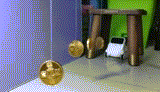

# Emotion Blocks

Emotion blocks make your Codey Rocky more human-like. It can smile, get naughty, or even turn to you for care. Isn't it marvelous?

## Add Emotion Blocks

### 1. Make sure "Codey" is selected and click "+" in the blocks area.

### 2. From the pop-up Extension Center page, click "+" to add emotion blocks.

### 3. Go back to Edit page. You can find emotion category added to the block palette.

## Have Some Fun

Let's try out the emotion blocks. We'll make a fun game. Codey Rocky bumps into a cave full of gold coins and starts collecting them.

Before coding, you need to hang up the chocolate coins, and the toy pan.

### 1. Drag a when Codey starts up block from the Events category to the scripts area. Add an Action block move forward at power \(\)% for \(\) secs, with 100% power for 0.5 second.

### 2. Add four Emotion blocks: look around, wow, look left, and look right.

### 3. Add another Action block move forward at power \(\)% for \(\) secs, with 100% power for 0.5 second.

### 4. Add a Control block repeat \(\), and input number 4. Then add an Emotion block yes and an action block move forward at power \(\)% for \(\) secs, with 100% power for 0.2 second.

### 5. Drag two more Emotion blocks: proud and smile.

### 6. Add another Action block move forward at power \(\)% for \(\) secs, with 100% power for 0.6 second.

### 7. Last, add three more Emotion blocks: startle, dizzy, and hurt.

### 8. Click "Upload" to upload the program to Codey.

### 9. Check how Codey Rocky collect gold coins!



